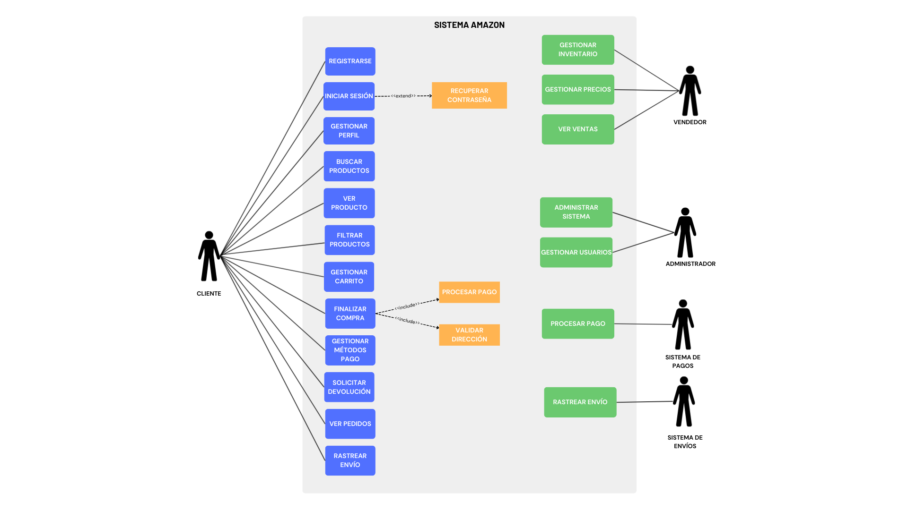

# Análisis de Requerimientos - Amazon

## Link Pagina Referencia

[Amazon.com](https://www.amazon.com/-/es/ref=nav_logo)

## Requerimientos Funcionales

### Usuarios

- RF1: El sistema debe permitir el registro de nuevos usuarios.
- RF2: El sistema debe permitir el inicio de sesión de usuarios registrados.
- RF3: El sistema debe permitir la recuperación de contraseñas.
- RF4: El sistema debe permitir crear y gestionar múltiples perfiles de compras.
- RF5: El sistema debe permitir editar información del perfil.
- RF6: El sistema debe permitir configurar privacidad del perfil.
- RF7: El sistema debe permitir añadir y gestionar direcciones de envío.
- RF8: El sistema debe permitir gestionar métodos de pago.
- RF9: El sistema debe permitir asociar cuentas a números de teléfono móvil.
- RF10: El sistema debe permitir solicitar cierre de cuenta y eliminación de datos personales.
- RF11: El sistema debe permitir ocultar pedidos del historial
- RF12: El sistema debe permitir consultar saldo de tarjetas regalo.
- RF13: El sistema debe permitir gestionar suscripciones digitales.

### Productos

- RF1: El sistema debe permitir la búsqueda de productos por categoría.
- RF2: El sistema debe permitir la búsqueda de productos por palabra clave.
- RF3: El sistema debe mostrar información detallada de productos.
- RF4: El sistema debe mostrar imágenes de productos.
- RF5: El sistema debe mostrar precios y disponibilidad.
- RF6: El sistema debe permitir filtrar productos por precio, marca, calificaciones.
- RF7: El sistema debe mostrar productos relacionados y recomendaciones.

### Carrito de Compras

- RF1: El sistema debe permitir agregar productos al carrito.
- RF2: El sistema debe permitir modificar cantidades en el carrito.
- RF3: El sistema debe permitir eliminar productos del carrito.
- RF4: El sistema debe calcular totales automáticamente.

### Compra

- RF1: El sistema debe permitir el acceso al checkout.
- RF2: El sistema debe validar información de envío.
- RF3: El sistema debe procesar pagos con tarjeta.
- RF4: El sistema debe procesar pagos con otro tipo de método.
- RF5: El sistema debe generar confirmaciones de pedido.
- RF06: El sistema debe enviar notificaciones por email.

### Pedidos

- RF1: El sistema debe permitir ver historial de pedidos.
- RF2: El sistema debe permitir rastrear envíos.
- RF3: El sistema debe permitir cancelar pedidos.
- RF4: El sistema debe permitir solicitar devoluciones.
- RF5: El sistema debe gestionar reembolsos.

### Vendedores

- RF1: El sistema debe permitir registro de vendedores.
- RF2: El sistema debe permitir gestión de inventario por vendedor.
- RF3: El sistema debe permitir gestión de precios por vendedor.
- RF4: El sistema debe permitir seguimiento de ventas.

## Requerimientos No Funcionales

### Rendimiento

- RNF1: El sistema debe cargar páginas en menos de 3 segundos.
- RNF2: El sistema debe soportar al menos 10,000 usuarios concurrentes.
- RNF3: El sistema debe procesar al menos 1,000 transacciones por minuto.

### Seguridad

- RNF1: El sistema debe encriptar todas las contraseñas.
- RNF2: El sistema debe usar HTTPS para todas las comunicaciones.
- RNF3: El sistema debe cumplir con estándares PCI DSS para pagos.
- RNF4: El sistema debe implementar autenticación de dos factores.

### Usabilidad

- RNF1: La interfaz debe ser intuitiva para usuarios de todas las edades.
- RNF2: El sistema debe ser responsive.
- RNF3: El sistema debe soportar múltiples idiomas.
- RNF4: El tiempo de aprendizaje para nuevos usuarios debe ser menor a 10 minutos.

### Compatibilidad

- RNF1: El sistema debe funcionar en Chrome, Firefox, Safari, Edge.
- RNF2: El sistema debe funcionar en iOS y Android.
- RNF3: El sistema debe integrarse con servicios de mensajería

## Actores Identificados

1. **Clienter**: Usuario que busca, compra productos y gestiona pedidos.
2. **Vendedor**: Usuario que vende productos en la plataforma.
3. **Administrador del Sistema**: Gestiona usuarios, productos y configuraciones generales.
4. **Administrador de Contenido**: Gestiona catálogo de productos, categorías y promociones

### Actores Secundarios

1. **Sistema de Pagos**: Procesa transacciones financieras.
2. **Sistema de Envíos**: Gestiona logística del envió de paquetes.
3. **Sistema de Notificaciones**: Envía correos electrónicos y notificaciones.
4. **Servicio de Atención al Cliente**: Gestiona soporte, reclamos y devoluciones.

## Diagrama de Casos de Uso

Este diagrama de casos de uso UML representa las funcionalidades principales del sistema de de Amazon y las interacciones entre los diferentes actores y el sistema.

### Actores
- Cliente: Actor principal ubicado a la izquierda, representa a los usuarios que compran en la plataforma.
- Vendedor: Actor ubicado en la parte superior derecha, representa a los comerciantes que venden productos.
- Administrador: Actor en la parte media derecha, encargado de la gestión del sistema.
- Sistema de Pagos: Actor secundario que procesa las transacciones financieras.
- Sistema de Envíos: Actor secundario que gestiona la logística de entrega.